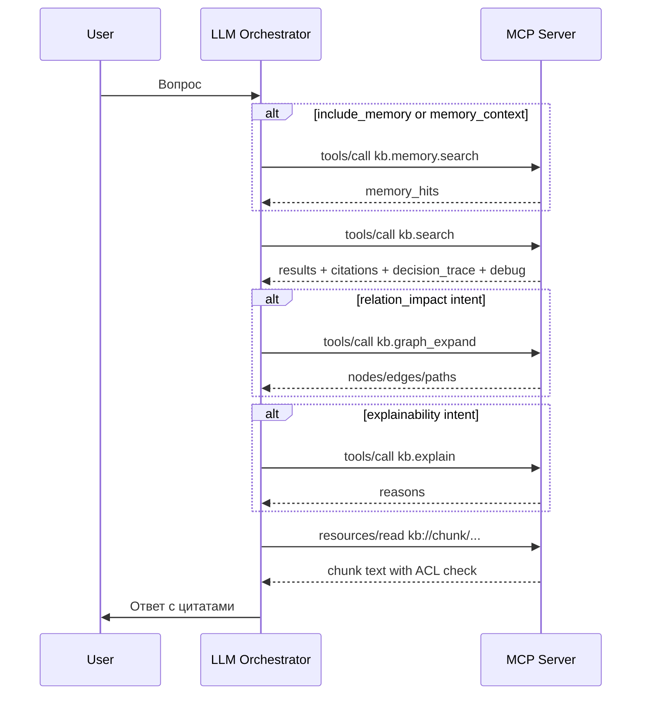

# Оценка реализации econolic/memorygraph_mcp относительно PRD Hybrid Retrieval MCP для KB

> Status note (2026-02-21): analytical snapshot document.
> Some conclusions here may be superseded by later implementation changes.
> Validate current behavior against `README.md`, `docs/install_deploy_config.md`, and live MCP smoke checks.

## Executive summary

**Enabled connectors:** github.

Репозиторий `econolic/memorygraph_mcp` (default branch: `main`, видимость: private) реализует “сквозной” MVP/v1‑каркас **Hybrid Retrieval MCP‑сервера**: ingestion (filesystem + git diff), hybrid retrieval (vector + graph + rerank + деградация), ресурсы `kb://*` с server‑side ACL проверкой, два транспорта (stdio + Streamable HTTP), production-baseline observability (JSON‑логи, audit, Prometheus exporter, OTel tracer), тесты, docker‑compose окружение (Qdrant + Neo4j + MCP). Это в целом хорошо совпадает с написанным PRD по архитектуре и набору контрактов.

Ключевые сильные стороны реализации:
- Реализован MCP‑сервер на базе FastMCP с **tools/resources/prompts** и Streamable HTTP endpoint `/mcp`, плюс transport‑защиты (DNS rebinding / Origin / allowlists) через настройки SDK, что соответствует требованиям MCP про безопасность транспорта. citeturn3search0  
- Есть полноценный ingestion с **инкрементальными апдейтами по checksum**, включая удаление устаревших чанков из vector + graph + metadata.  
- Реализован quality harness: `bench/run_benchmark.py` считает Recall@10 и nDCG@10 и может “гейтить” релиз, что прямо соответствует KPI в PRD.  

Основные расхождения с PRD (актуальные на текущем срезе):
- OAuth 2.1/OIDC (`strict_oauth`) для HTTP-транспорта пока не внедрен; используется JWT `dual|strict`.
- CI benchmark-diff pipeline ещё не автоматизирован (локальные benchmark gates есть, но нет PR-level diff policy).
- Auto-ingest работает стабильно, но advanced hardening (`git_diff + periodic full`, retry/backoff policy) остаётся задачей следующего цикла.

Отдельно: репозиторий приватный, поэтому внешние web‑инструменты не могут открывать исходники по URL. Все ссылки на код и фрагменты кода приведены по данным из GitHub‑коннектора; внешние нормативные утверждения подтверждены официальными веб‑источниками (MCP spec, docs Qdrant/Neo4j/SBERT).

## Update (2026-02-21, post-implementation)

Ниже краткий статус после внедрения плана доработки:

- Фильтры retrieval (`tags`, `sources`, `updated_after`) применяются end-to-end в `qdrant` и `in-memory`.
- В `kb.search.debug` добавлены и возвращаются поля:
  - `filters_effective`
  - `graph_acl_enforced`
  - `fusion_mode`
  - `graph_seed_count`
  - `graph_node_count`
  - `graph_chunk_bonus_count`
  - `graph_nonzero`
- Object-level ACL для graph операций выровнен (`resolve_entities`, `expand`, `explain_uri`), утечки вне ACL в пределах workspace заблокированы.
- Закрыт graph-gap для relation-impact запросов: `resolve_entities` в Neo4j поддерживает tokenized matching, а контрольный integration тест фиксирует ненулевой graph bonus.
- Для Qdrant добавлена idempotent инициализация payload-indexes (`workspace_id`, `acl_allow`, `source`, `source_path`, `updated_at`, `tags`).
- Добавлены режимы качества retrieval:
  - `KB_CHUNKING_MODE=char|sentence`
  - `KB_FUSION_MODE=linear|rrf`
- Embeddings pipeline усилен: batch encode, revision pinning, in-proc LRU cache, batched OpenAI-compatible requests с partial fallback.
- Entity extraction усилен: `EntityExtractionConfig`, stoplist/min_len/allowlist patterns, alias merge без перезаписи, relation rules по ближайшим сущностям к trigger.
- Observability доведён до production-baseline: OTel (`Resource(service.name=...)` + OTLP exporter) и Prometheus (`/metrics` на отдельном порту).
- Добавлены и проходят профильные тесты по фильтрам/ACL/indexes/chunking/fusion/rerank.
- Включена автоактуализация по умолчанию:
  - `KB_AUTO_INGEST_ENABLED=true`
  - startup cycle + interval refresh для roots из `KB_AUTO_INGEST_ROOTS`.

## Область, источники и ограничения

**Какой PRD сравнивался:** `prd_hybrid_retrieval_mcp_knowledge_base.md` в этом же репозитории (default branch `main`). В PRD заданы цели, KPI, онтология (Document/Chunk/Entity), инструменты MCP (`kb.search`, `kb.graph_expand`, `kb.explain`), ресурсы `kb://doc|chunk|entity`, требования по ACL, аудит, observability и offline‑оценка качества.

**Внешние источники (официальные/первичные):**
- MCP Streamable HTTP transport + security warning (Origin validation, localhost binding, auth). citeturn3search0turn3search1  
- MCP Authorization (OAuth‑2.1‑совместимая модель для HTTP‑транспортов). citeturn3search2turn3search6  
- MCP Tools и Resources (контракты discovery и security considerations). citeturn3search11turn3search7turn3search3  
- Qdrant: neural search tutorial (384 dims, модель all‑MiniLM‑L6‑v2), query_points API, payload indexing и strict mode. citeturn4search1turn4search9turn4search0turn4search3  
- Neo4j: variable-length patterns + рекомендации по производительности и ограничениям, а также предупреждение “read routing ≠ access control”. citeturn5search1turn5search0  
- Sentence‑Transformers: cross‑encoder reranker требует пары текстов (query, passage) + практики rerank top‑k. citeturn7search0turn7search2turn7search12  
- GraphRAG позиционирование (vector RAG + graph traversal), как обоснование hybrid retrieval. citeturn6search1  
- (Опционально, для альтернативного vector backend) entity["organization","pgvector","postgres vector extension"]: базовые конструкции `CREATE EXTENSION vector`, nearest neighbor operators, hybrid search идеи. citeturn6search0  

**Ограничение по ссылкам на исходники:** репозиторий приватный, поэтому ссылки на файлы и строки приведены GitHub‑перmalink’ами (в код‑блоках); внешние web‑цитаты применимы только к спецификациям и документации.

## Архитектура проекта и целевая PRD‑архитектура

Фактическая runtime‑архитектура (на уровне модулей) соответствует PRD “Router → VectorRetriever → EntityResolver/GraphRetriever → Fusion → Rerank → EvidenceBuilder”, плюс добавлены memory‑операции и ingestion Tools.

```mermaid
flowchart LR
  A[LLM Host / Agent] --> B[MCP Client]
  B -->|stdio or Streamable HTTP| S[FastMCP server /mcp]

  subgraph S[hybrid-kb-mcp]
    T1[kb.search] --> R[QueryRouter]
    R --> HR[HybridRetriever]
    HR --> VS[VectorStore]
    HR --> GS[GraphStore]
    HR --> F[Fusion + lexical blend]
    F --> RR[Reranker (CrossEncoder)]
    RR --> EB[EvidenceBuilder]
    EB --> OUT[Evidence results + citations]

    T2[kb.graph_expand] --> GS
    T3[kb.explain] --> GS

    M1[kb.memory.*] --> VS
    M1 --> GS
    M1 --> META[Metadata backend]
    ING[kb.ingest.*] --> VS
    ING --> GS
    ING --> META
  end

  VS --> Q[(Qdrant)]
  GS --> N[(Neo4j)]
  META --> SQL[(SQLite/Postgres)]
```

Последовательность MCP‑взаимодействий с LLM‑оркестратором (соответствует policy в репо):



С точки зрения MCP transport security требования MCP к Streamable HTTP включают обязательную Origin‑валидацию и рекомендации по localhost bind + auth; это должно быть реализовано при поднятии HTTP‑сервера. citeturn3search0turn3search1

## Соответствие PRD по разделам

### Матрица “PRD → реализация”

Статусы:
- **Реализовано**: покрыто и работает end‑to‑end в текущем коде
- **Частично**: есть базовая реализация, но отсутствуют ключевые элементы PRD/есть ограничения
- **Отсутствует**: не реализовано (или указано, но фактически не действует)

| Раздел PRD | Статус в repo | Основные точки кода |
|---|---|---|
| Онтология/схема графа | Реализовано (MVP+) | Neo4jGraphStore: Document/Chunk/Entity + CONTAINS/MENTIONS/DOCUMENTED_IN + доменные rel’ы; object-level ACL enforcement для graph retrieval включен |
| Ingestion | Реализовано (MVP/v1+) | IngestionPipeline: filesystem + git diff + checksum + cleanup stale chunks + workspace-consistent identity |
| Chunking | Реализовано (флагируемо) | `KB_CHUNKING_MODE=char|sentence`, дефолт `char` для совместимости |
| Embeddings | Реализовано (P1 baseline) | LocalSentenceTransformerEmbedder + OpenAI-compatible: batch encode, revision pinning, LRU cache, partial fallback |
| Entity extraction | Реализовано (P1 baseline) | `EntityExtractionConfig`, stoplist/min_len/allowlist, alias merge, relation extraction по ближайшим сущностям |
| Vector store | Реализовано (MVP+) | QdrantVectorStore + in‑memory; filters `tags/sources/updated_after/workspace/acl` применяются, payload indexes создаются idempotent |
| Graph store | Реализовано (MVP+) | Neo4jGraphStore + in‑memory; `resolve_entities/expand/explain_uri` учитывают object-level ACL |
| Fusion/rerank | Реализовано (MVP+) | `linear|rrf` fusion по флагу + CrossEncoder rerank с сохранением fallback поведения |
| MCP tools/resources/prompts | Реализовано | kb.search / kb.graph_expand / kb.explain / kb.memory.* / kb.ingest.* + resources kb://* + prompts |
| Транспорт | Реализовано | FastMCP transports: stdio + streamable-http path `/mcp` |
| Auth/ACL | Частично | JWT (dual/strict) + deny-by-default ACL + resource ACL + graph ACL; OAuth 2.1 transport auth не внедрен |
| Observability | Реализовано (P1 baseline) | JSON logs + audit, Prometheus counters/histograms (`/metrics` exporter), OTel tracing c OTLP exporter |
| Тесты | Реализовано (расширено) | pytest unit/integration + `bench/run_benchmark.py` gates + отдельные тесты filters/graph ACL/qdrant indexes/chunking/fusion/rerank |
| Актуализация знаний | Реализовано (default-on) | Автоактуализация `KB_AUTO_INGEST_*`: startup cycle + interval refresh по roots |

Ниже — “разбор по разделам” с указанием артефактов и коротких цитат.
Важно: часть детального разбора ниже фиксирует исторические наблюдения pre-implementation; актуальный статус соответствия отражен в матрице выше и в блоке `Update (2026-02-21, post-implementation)`.

### Разбор по разделам с привязкой к коду

> Формат ссылок на код: GitHub permalink (private repo) — откроется при наличии доступа.

**Онтология/схема графа** — *реализовано (MVP+)*  
Имплементировано: `Document`, `Chunk`, `Entity`, рёбра `CONTAINS`, `MENTIONS`, `DOCUMENTED_IN`, плюс `DEPENDS_ON|CALLS|OWNS|IMPLEMENTS|AFFECTS`.  
Ключевой код: `kb_mcp/storage/neo4j_store.py` (методы `upsert_mentions`, `upsert_entity_relations`, `resolve_entities`, `expand`).  
Короткая цитата (создание нужных узлов/рёбер):
```python
"MERGE (d:Document {uri: $doc_uri, workspace_id: $workspace_id}) "
"MERGE (c:Chunk {uri: $chunk_uri, workspace_id: $workspace_id}) "
"MERGE (d)-[:CONTAINS]->(c) "
"MERGE (c)-[:MENTIONS]->(e) "
"MERGE (e)-[:DOCUMENTED_IN]->(d)"
```
Ссылка:
```text
https://github.com/econolic/memorygraph_mcp/blob/main/kb_mcp/storage/neo4j_store.py
```
Разрыв по object-level ACL закрыт: graph retrieval и explainability проходят через ACL-фильтрацию; в качестве remaining risk остаётся качество доменных relation edges (нужен периодический quality контроль на размеченном наборе).  

**Ingestion** — *реализовано*  
Есть два инструмента ingestion (tools): `kb.ingest.filesystem` и `kb.ingest.git_diff` в MCP‑сервере. Внутри — инкрементальный pipeline на checksum, плюс удаление устаревших чанков из vector/graph/metadata.  
Код: `kb_mcp/ingest/pipeline.py`, `kb_mcp/server/app.py`, `kb_mcp/ingest/connectors/{filesystem,git}.py`.  
Цитата (checksum и пропуск без изменения):
```python
checksum = self._checksum(text)
prev = self._metadata.get_checksum(workspace_id=workspace_id, source_path=source_path)
if prev == checksum:
    continue
```
Ссылки:
```text
https://github.com/econolic/memorygraph_mcp/blob/main/kb_mcp/ingest/pipeline.py
https://github.com/econolic/memorygraph_mcp/blob/main/kb_mcp/server/app.py
```

**Chunking** — *реализовано (флагируемо)*  
Реализован простой sliding window по символам с overlap, плюс sentence-aware режим через `KB_CHUNKING_MODE=char|sentence`.  
Код: `kb_mcp/ingest/chunking.py`.  
Цитата:
```python
def chunk_text(text: str, *, max_chars: int = 800, overlap: int = 120) -> list[dict[str, object]]:
```
Ссылка:
```text
https://github.com/econolic/memorygraph_mcp/blob/main/kb_mcp/ingest/chunking.py
```
Риск качества в `char` режиме остаётся, но теперь контролируется feature-флагом и может быть переключён на `sentence` без изменения API.  

**Embeddings** — *реализовано (P1 baseline)*  
Есть embedder abstraction и два режима: локальный sentence‑transformers и OpenAI‑совместимый HTTP `/embeddings`, оба с батчированием, кэшированием и детерминированным fallback.  
Код: `kb_mcp/ingest/embeddings.py`, загрузка через `kb_mcp/bootstrap.py`.  
Цитата (локальный ST: batch + нормализация):
```python
vectors = self._model.encode(texts, normalize_embeddings=True, batch_size=self._batch_size)
return [[float(v) for v in vec] for vec in vectors]
```
Ссылки:
```text
https://github.com/econolic/memorygraph_mcp/blob/main/kb_mcp/ingest/embeddings.py
https://github.com/econolic/memorygraph_mcp/blob/main/kb_mcp/bootstrap.py
```
Соответствие PRD: embeddings pipeline закрыт для MVP/P1 (batch/cache/revision pinning/traceability). Из remaining design-задач остаются multi-vector схемы и benchmark-diff automation (P2).

**Entity extraction** — *реализовано (P1 baseline)*  
Реализован regex‑extractor + `EntityExtractionConfig` (`stoplist`, `min_len`, `allowlist_patterns`), alias extraction/merge и rule‑based relation extraction с выбором ближайших сущностей к relation trigger.  
Код: `kb_mcp/ingest/entity_extract.py`.  
Цитата:
```python
_TABLE_RE = re.compile(r"\b([a-z_]+\.[a-z_]+)\b", re.IGNORECASE)
...
def extract_entity_relations(
    text: str, entity_uris: list[str], cfg: EntityExtractionConfig | None = None
) -> list[dict[str, str]]:
```
Ссылка:
```text
https://github.com/econolic/memorygraph_mcp/blob/main/kb_mcp/ingest/entity_extract.py
```
Главные ограничения vs PRD: остаётся rule-based характер extraction (без ML NER/RE), поэтому для production quality нужен регулярный offline precision/FPR контроль на размеченном наборе.

**Vector store** — *реализовано (MVP+)*  
Есть полноценный backend для Qdrant и in‑memory backend; используется `query_points` с фильтрацией по `workspace_id` и `acl_allow`. Векторный размер проверяется на совпадение с embedder.dimensions.  
Код: `kb_mcp/storage/qdrant_store.py`.  
Цитата (query_points + filter):
```python
response = self._client.query_points(
    collection_name=collection_name,
    query=self._embedder.embed_query(query),
    query_filter=self._build_filter(filters),
    limit=top_k,
    with_payload=True,
)
```
Ссылка:
```text
https://github.com/econolic/memorygraph_mcp/blob/main/kb_mcp/storage/qdrant_store.py
```
С точки зрения native API Qdrant, `query_points` и фильтры — стандартная конструкция. citeturn4search9turn4search7  
Разрыв с PRD по filters/indexes закрыт: `tags/sources/updated_after` применяются в поиске, payload-indexes для ключевых фильтров создаются idempotent на старте backend.

**Graph store** — *реализовано (MVP+)*  
Есть backend для Neo4j и in‑memory backend. В Neo4j используется `execute_query(... database_=..., routing_=READ)`; это корректно с точки зрения драйвера, но само по себе не является механизмом access control (Neo4j прямо предупреждает не использовать “read mode” как security). citeturn5search0  
Код: `kb_mcp/storage/neo4j_store.py`.  
Цитата (expand по переменной длине пути):
```python
node_query = (
  f"MATCH p=(a)-[*1..{bounded_depth}]-(b) "
  "WHERE a.uri IN $seed_uris ..."
)
```
Ссылка:
```text
https://github.com/econolic/memorygraph_mcp/blob/main/kb_mcp/storage/neo4j_store.py
```
Риск масштабирования: variable-length паттерны могут резко раздувать число путей/кандидатов; Neo4j рекомендует делать такие паттерны максимально специфичными/ограниченными для производительности. citeturn5search1  
Graph retrieval использует object-level ACL фильтрацию, а для relation-impact диагностики в `kb.search.debug` доступны `graph_seed_count`, `graph_node_count`, `graph_chunk_bonus_count`, `graph_nonzero`.

**Fusion/rerank** — *реализовано (простое)*  
Fusion: линейное взвешивание (vector/graph/memory) + доп. lexical blend; затем rerank cross‑encoder (или fallback).  
Код: `kb_mcp/retrieval/fusion.py`, `kb_mcp/retrieval/hybrid.py`, `kb_mcp/retrieval/rerank.py`.  
Цитата (fusion weights):
```python
class FusionWeights:
    w_vector: float = 0.70
    w_graph: float = 0.20
    w_memory: float = 0.10
```
Цитата (rerank через пары (query, passage)):
```python
pairs = [(query, item.text or item.uri) for item in items]
raw_scores = self._model.predict(pairs)
```
Ссылки:
```text
https://github.com/econolic/memorygraph_mcp/blob/main/kb_mcp/retrieval/hybrid.py
https://github.com/econolic/memorygraph_mcp/blob/main/kb_mcp/retrieval/rerank.py
```
Это соответствует базовой best practice: cross‑encoder принимает **ровно два текста** (query, text) и применяется для rerank top‑k. citeturn7search0turn7search2  
Замечание: код дополнительно применяет sigmoid к тому, что возвращает `predict()`. У SentenceTransformers по умолчанию activation может уже быть sigmoid для num_labels=1; повторный sigmoid монотонен (ранжирование сохранит порядок), но “склеит” разницы. citeturn7search0turn7search12  

**MCP tools/resources/prompts** — *реализовано*  
MCP сервер объявляет:
- tools: `kb.search`, `kb.graph_expand`, `kb.explain`, `kb.memory.upsert/search/delete`, `kb.ingest.filesystem`, `kb.ingest.git_diff`
- resources: `kb://doc/{doc_id}`, `kb://chunk/{chunk_id}`, `kb://entity/{entity_id}`, `kb://memory/{memory_id}`, `kb://policy/tool-selection`
- prompts: `kb.answer_with_citations`, `kb.tool_selection_policy`, `kb.incident_triage`, `kb.memory_grounded_reply`  
Код: `kb_mcp/server/app.py`.  
Цитата (endpoint `/mcp` и Streamable HTTP):
```python
mcp = FastMCP(..., streamable_http_path="/mcp", ...)
```
Ссылка:
```text
https://github.com/econolic/memorygraph_mcp/blob/main/kb_mcp/server/app.py
```
С точки зрения MCP spec, корректно использовать tools discovery (`tools/list`) и tool invocation (`tools/call`). citeturn3search11  
Resources должны быть безопасны: URIs валидируются, права проверяются, чувствительные ресурсы защищаются. citeturn3search3turn3search7  
В этом репо ресурсы действительно перед выдачей проверяют ACL (`_resource_allowed`).  

**Транспорт** — *реализовано*  
Запуск: `kb_mcp/server/transport_http.py` и `kb_mcp/server/transport_stdio.py`.  
Код реализует Streamable HTTP (stateless) и stdio режим. Требования MCP к stdio — не писать ничего кроме MCP сообщений в stdout — обеспечиваются SDK‑уровнем, но это важно помнить при расширениях. citeturn3search0  
Ссылки:
```text
https://github.com/econolic/memorygraph_mcp/blob/main/kb_mcp/server/transport_http.py
https://github.com/econolic/memorygraph_mcp/blob/main/kb_mcp/server/transport_stdio.py
```

**Auth/ACL** — *частично*  
JWT‑auth с режимами `dual` и `strict` + server‑side ACL (deny‑by‑default).  
Код: `kb_mcp/security/auth.py`, `kb_mcp/security/acl.py`, enforcement в `kb_mcp/server/app.py` и в vector retrieval filter.  
Цитата (bearer token parsing):
```python
auth_value = headers.get("authorization")
if auth_value.lower().startswith("bearer "):
    token = auth_value[len(prefix):].strip()
```
Ссылка:
```text
https://github.com/econolic/memorygraph_mcp/blob/main/kb_mcp/security/auth.py
```
Официальная рекомендация MCP для HTTP‑authorization — OAuth‑2.1‑совместимая модель и обязательный `Authorization: Bearer ...` header на каждый запрос. citeturn3search2turn3search6  
Здесь OAuth не реализован (используется локальный JWT секрет), поэтому соответствие MCP authorization spec — **частичное** (есть bearer header, но нет OAuth flows/metadata/dynamic registration).

**Observability** — *реализовано (P1 baseline)*  
Есть:
- request id (contextvar) `ensure_request_id`
- audit logger с `params_hash`, latency, identity source
- in‑proc метрики (counters + p95 по таймерам)
- Prometheus counters/histograms (`kb_tool_calls_total`, `kb_tool_latency_ms`, `kb_retrieval_stage_latency_ms`, `kb_auto_ingest_*`)
- OpenTelemetry tracing с OTLP exporter и `Resource(service.name=...)`  
Код: `kb_mcp/observability/{audit,metrics,tracing}.py`, включение в `server/app.py`.  
Ссылки:
```text
https://github.com/econolic/memorygraph_mcp/blob/main/kb_mcp/observability/audit.py
https://github.com/econolic/memorygraph_mcp/blob/main/kb_mcp/observability/metrics.py
https://github.com/econolic/memorygraph_mcp/blob/main/kb_mcp/observability/tracing.py
```
Остающийся зазор: нет преднастроенных dashboards/alerts и SLO budget policy в репозитории (это организационный/ops слой поверх уже добавленной телеметрии).

**Тесты и KPI‑метрики** — *реализовано (unit + offline harness)*  
Есть unit tests на ACL/router/fallback/rerank/ingestion/persistence; есть benchmark harness, считающий Recall@10/nDCG@10/MRR и P95 latency gates (встроенные пороги совпадают с PRD).  
Код: `tests/*`, `bench/run_benchmark.py`.  
Ссылки:
```text
https://github.com/econolic/memorygraph_mcp/blob/main/bench/run_benchmark.py
https://github.com/econolic/memorygraph_mcp/blob/main/tests/test_hybrid_fallback.py
```

## Сильные стороны, слабые стороны и риски

### Сильные стороны

**Сильная интеграция с MCP primitives (tools/resources/prompts) + transport security.**  
Проект явно учитывает транспортные угрозы (DNS rebinding/Origin/allowlists) и поднимает `/mcp` как Streamable HTTP endpoint. Это соответствует явным предупреждениям MCP о том, что без Origin validation и auth локальные MCP‑сервера могут быть атакованы через DNS rebinding. citeturn3search0turn3search1  
Плюс — наличие policy‑ресурса `kb://policy/tool-selection` и prompt‑шаблонов, что заметно упрощает подключение LLM‑оркестратора.

**Правильный “shape” hybrid retrieval и корректный rerank API‑паттерн.**  
Cross‑encoder применяется на парах `(query, item.text)` (как и должен), и используется как reranker top‑N, что соответствует рекомендациям SentenceTransformers: cross‑encoder точнее, но дорогой, поэтому используется на top‑k кандидатов. citeturn7search2turn7search0  

**Инкрементальная ingestion и cleanup stale data.**  
Pipeline не только добавляет/обновляет, но и удаляет “stale” чанки во всех слоях. Это существенно снижает проблему “мусорного KB”, характерную для многих MVP.

**Наличие качественного benchmark harness с метриками PRD.**  
`bench/run_benchmark.py` измеряет Recall@10, nDCG@10, MRR и latency p95; сценарий gating на порогах PRD формализует миграцию от “работает” к “работает и держит качество”.

### Слабые стороны и потенциальные баги

**OAuth 2.1/OIDC transport auth пока отсутствует.**  
Текущая модель (`dual|strict` JWT) закрывает локальные и controlled deployment сценарии, но для enterprise SSO и MCP-compatible OAuth metadata нужен `strict_oauth` профиль (P2).

**Benchmark-diff CI отсутствует.**  
Локальные benchmark gates работают, но нет автоматического PR-level сравнения baseline/new с fail policy при регрессии.

**Neo4j variable-length traversal потенциально дорог.**  
`MATCH p=(a)-[*1..depth]-(b)` даже при глубине ≤4 может взрываться на графах с высокой степенью, особенно если в одном workspace много документов и сущностей. Neo4j рекомендует делать такие запросы более специфичными (например, ограничивать типы отношений или добавлять pruning). citeturn5search1  

**Auto-ingest hardening ограничен базовым циклом.**  
Есть startup + interval cycle, counters и логи, но нет расширенной retry/backoff стратегии и гибридного режима `git_diff + periodic full`.

**Reranker: двойной sigmoid (вероятно) и отсутствие провайдера `llm`.**  
`RerankConfig.provider` присутствует (`cross_encoder|llm`), но фактическая реализация — всегда CrossEncoder (или fallback). Кроме того, `CrossEncoder.predict()` может уже возвращать sigmoid‑скоры для num_labels=1; повторная sigmoid‑трансформация может ухудшить калибровку (хотя порядок сохраняется). citeturn7search0turn7search12  

**Chunking может ухудшить качество evidence/snippet.**  
Текущий chunking — фиксированный по символам; для кода/SQL/markdown это часто приемлемо, но для текстовой документации качество часто лучше при sentence‑aware или semantic chunking (в примерах Qdrant учебных материалов это прямо сравнивается). citeturn4search6  

## Рекомендации и приоритетный roadmap

### Актуальный roadmap (после закрытия P0/P1)

Закрыто в текущем цикле:
- object-level ACL для graph retrieval;
- graph-gap в Neo4j resolver (tokenized matching);
- filters `tags/sources/updated_after` end-to-end;
- payload indexes в Qdrant;
- feature flags `KB_FUSION_MODE`, `KB_CHUNKING_MODE`;
- расширенные debug-поля `kb.search`;
- entity extraction quality baseline (`EntityExtractionConfig`, alias merge, nearest-entity relations);
- embeddings quality/perf baseline (batching, cache, model revision pinning, partial fallback);
- observability production baseline (OTel + Prometheus exporter);
- автоактуализация по умолчанию (`KB_AUTO_INGEST_*`).

### Следующие шаги для доработки

| Приоритет | Следующий шаг | Ожидаемый эффект | Критерий готовности | Изменяемые файлы |
|---|---|---|---|---|
| P2 | OAuth 2.1/OIDC JWKS transport auth (`strict_oauth`) | Соответствие MCP auth best practices и enterprise SSO | Реализован token verifier flow + migration path `dual -> strict -> strict_oauth` | `kb_mcp/security/auth.py`, `kb_mcp/server/transport_http.py`, `docs/install_deploy_config.md` |
| P2 | Benchmark-diff CI и расширение benchmark dataset (RU+EN, >300 queries) | Более надежная и автоматизированная оценка retrieval quality | Автоматический diff baseline/new в CI + fail policy на регрессии | `bench/queries.jsonl`, `bench/relevance.jsonl`, `bench/run_benchmark.py`, `.github/workflows/benchmark.yml` |
| P2 | Auto-ingest hardening: `git_diff + periodic full`, retry/backoff policy и smoke freshness tests | Предсказуемая свежесть индекса и контролируемое восстановление после сбоев | Нет “stale” инцидентов в smoke периоде + метрики причин фейлов | `kb_mcp/ingest/auto_ingest.py`, `kb_mcp/ingest/pipeline.py`, `docs/runbook.md` |
| P2 | Observability maturity: дашборды/алерты и SLO policy поверх уже внедренных метрик/трейсов | Быстрее RCA и формализованные SLO для retrieval/ingest | Набор alert rules + runbook ссылок + weekly KPI snapshot | `docs/runbook.md`, `docs/kpi_report.md`, infra manifests |

### План тестов и метрик качества для следующего цикла

Что уже есть:
- Recall@10, nDCG@10, MRR, P95 latency и citation coverage в benchmark harness.

Что добавить:
- regression suite на фиксированном mini-corpus с ожидаемыми citations;
- quality-метрики по entity extraction (precision/false-positive rate на размеченном наборе);
- ingestion freshness SLI: время от изменения файла до появления в retrieval;
- stage-level latency telemetry (vector/graph/rerank) через экспортируемые метрики.

## MCP‑контракт, payload‑примеры, LLM‑flow и code skeletons

### Соответствие MCP spec и предложения по контракту

**Tools/list и tools/call.**  
MCP определяет механизмы discovery и вызова инструментов через JSON‑RPC методы `tools/list` и `tools/call`. citeturn3search11  

**Resources/read.**  
Resources должны иметь валидируемые URI, содержать content (text/blob) и учитывать security considerations (проверка прав доступа). citeturn3search3turn3search7  

**Streamable HTTP transport и безопасность.**  
MCP требует Origin validation (MUST) и рекомендует localhost bind (SHOULD) + auth. citeturn3search0turn3search1  
В repo добавлены allowlists hosts/origins и включена DNS rebinding защита через transport_security settings.

**Auth.**  
MCP authorization spec описывает OAuth‑2.1‑совместимый transport‑уровень; в repo — JWT‑auth (local secret). Для production‑совместимости с экосистемой MCP целесообразно либо строго документировать “локальный JWT режим”, либо добавить OAuth flow. citeturn3search2turn3search6  

### Примеры JSON‑RPC payloads

**Streamable HTTP: tools/list**
```http
POST /mcp HTTP/1.1
Accept: application/json, text/event-stream
Content-Type: application/json
Authorization: Bearer <jwt>

{"jsonrpc":"2.0","id":"1","method":"tools/list","params":{}}
```

**tools/call: kb.search (упрощённо под текущие schemas)**
```json
{
  "jsonrpc": "2.0",
  "id": "2",
  "method": "tools/call",
  "params": {
    "name": "kb.search",
    "arguments": {
      "payload": {
        "query": "Где документирован контракт API Z?",
        "mode": "hybrid",
        "top_k": 10,
        "workspace_id": "w1",
        "session_id": "s1",
        "include_memory": true,
        "filters": {
          "tags": [],
          "sources": [],
          "updated_after": null,
          "acl": { "subject": "u1", "roles": ["reader"], "workspace_id": "w1", "jwt_bearer": null }
        },
        "graph": { "expand_depth": 2, "edge_types": ["DEPENDS_ON", "DOCUMENTED_IN", "MENTIONS"], "max_nodes": 200 },
        "rerank": { "enabled": true, "provider": "cross_encoder", "top_n": 10 }
      }
    }
  }
}
```

**stdio transport** — тот же JSON‑RPC, но newline‑delimited. Важно: stdout сервера должен содержать только MCP‑сообщения. citeturn3search0  

### Рекомендуемый prompt template для LLM‑оркестратора

(Смысл совпадает с `docs/tool_selection_policy.md` и runtime prompt в `server/app.py`.)

```text
SYSTEM:
Ты работаешь через MCP KB.
1) Если вопрос проверяемый — сначала вызывай tools.
2) Приоритет: kb.memory.search -> kb.search -> kb.graph_expand (если связи) -> kb.explain (если нужно объяснение).
3) Каждое утверждение в ответе должно иметь citation на kb://chunk/... (и span).
4) Если evidence отсутствует — явно сообщи "evidence не найдено".
5) Если граф недоступен — ответ только по vector evidence и отмечай ограничение.
6) Не сохраняй память без citations и confidence >= threshold.
```

### Skeletons кода для доработок

Ниже — “скелеты” именно под зоны роста (ACL‑graph, filters, RRF, tool handlers). Они совместимы с текущей архитектурой проекта.

#### Ingestion worker с очередью (для масштабирования)

```python
from __future__ import annotations

from dataclasses import dataclass
from queue import Queue
from threading import Thread
from typing import Callable, Optional


@dataclass(frozen=True)
class IngestTask:
    root: str
    workspace_id: str
    acl_allow: list[str]
    changed_files: Optional[list[str]] = None


class IngestWorker:
    def __init__(
        self,
        *,
        queue: Queue[IngestTask],
        handler: Callable[[IngestTask], dict[str, int]],
        num_threads: int = 2,
    ) -> None:
        self._q = queue
        self._handler = handler
        self._threads = [Thread(target=self._run, daemon=True) for _ in range(num_threads)]

    def start(self) -> None:
        for t in self._threads:
            t.start()

    def _run(self) -> None:
        while True:
            task = self._q.get()
            try:
                self._handler(task)
            finally:
                self._q.task_done()
```

#### Интерфейсы retriever’ов (как contracts для тестирования)

```python
from __future__ import annotations

from dataclasses import dataclass
from typing import Protocol


@dataclass(frozen=True)
class Candidate:
    uri: str
    text: str
    score: float
    meta: dict[str, object]


class VectorRetriever(Protocol):
    def retrieve(self, *, query: str, k: int, filters: dict[str, object]) -> list[Candidate]:
        raise NotImplementedError


class GraphRetriever(Protocol):
    def seed_entities(self, *, query: str, filters: dict[str, object]) -> list[str]:
        raise NotImplementedError

    def expand(self, *, seeds: list[str], depth: int, filters: dict[str, object]) -> dict[str, float]:
        """Return bonus/prior over URIs (chunk/entity)."""
        raise NotImplementedError
```

#### Fusion: добавить RRF как альтернативу линейной модели

RRF полезен тем, что не требует калибровки score‑шкал (работает по рангу). Применяется во многих hybrid‑системах. citeturn7search11turn7search14  

```python
from __future__ import annotations

from collections import defaultdict
from dataclasses import dataclass


@dataclass(frozen=True)
class RankedList:
    uris: list[str]


def rrf_fuse(*lists: RankedList, k: int = 60) -> list[tuple[str, float]]:
    scores: dict[str, float] = defaultdict(float)
    for lst in lists:
        for rank, uri in enumerate(lst.uris, start=1):
            scores[uri] += 1.0 / (k + rank)
    return sorted(scores.items(), key=lambda x: x[1], reverse=True)
```

#### Исправление object‑level ACL в graph store (идея)

```python
# Псевдо-Cypher подход:
# 1) записывать acl_allow в Document и Chunk
# 2) в expand добавлять:
#    AND any(sub IN coalesce(n.acl_allow, []) WHERE sub IN $subjects)

def build_acl_predicate() -> str:
    return "any(sub IN coalesce(n.acl_allow, []) WHERE sub IN $subjects)"
```

#### MCP tool handler: нормализовать filters и запрещать “мертвые” фильтры

```python
def normalize_filters(filters: dict[str, object]) -> dict[str, object]:
    # Fail-fast: если schema объявляет фильтр, но backend не умеет — лучше явная ошибка/лог.
    supported_keys = {"workspace_id", "acl_subject", "tags", "sources", "updated_after"}
    unknown = set(filters) - supported_keys
    if unknown:
        raise ValueError(f"unsupported_filters: {sorted(unknown)}")
    return filters
```

#### Клиент‑пример вызова MCP tools (HTTP)

```python
from __future__ import annotations

from typing import Any
import httpx


def tools_call(
    *,
    base_url: str,
    token: str,
    name: str,
    arguments: dict[str, Any],
    rpc_id: str = "1",
) -> dict[str, Any]:
    payload = {
        "jsonrpc": "2.0",
        "id": rpc_id,
        "method": "tools/call",
        "params": {"name": name, "arguments": arguments},
    }
    headers = {
        "Accept": "application/json, text/event-stream",
        "Content-Type": "application/json",
        "Authorization": f"Bearer {token}",
    }
    r = httpx.post(f"{base_url}/mcp", json=payload, headers=headers, timeout=30.0)
    r.raise_for_status()
    return r.json()
```

### Security checklist и пример ACL policy

Transport‑уровень (HTTP):
- Origin validation (обязательно). citeturn3search0  
- localhost bind по умолчанию для локального режима (рекомендация). citeturn3search0  
- аутентификация на каждом HTTP запросе через bearer header. citeturn3search6  

Data‑уровень:
- server‑side ACL enforcement для tools и resources (в PRD это must).  
- единая ACL‑логика для vector/graph/metadata (сейчас не полностью выполнено).  

Пример policy (deny‑by‑default):
```yaml
policy_version: "2026-02-21"
default: deny
workspaces:
  w1:
    subjects:
      u1:
        roles: ["reader"]
      u2:
        roles: ["admin"]
    roles:
      reader:
        allow_tools: ["kb.search", "kb.memory.search", "kb.graph_expand", "kb.explain"]
      admin:
        allow_tools: ["kb.search", "kb.graph_expand", "kb.explain", "kb.ingest.filesystem", "kb.ingest.git_diff",
                      "kb.memory.upsert", "kb.memory.delete"]
```

### CI/CD и deployment

**docker-compose** уже есть в репо (Qdrant + Neo4j + MCP). Для Qdrant важно помнить про фильтруемые поля и payload indexing (иначе latency под фильтрами деградирует). citeturn4search0turn4search3  

Kubernetes skeleton (минимальный):
```yaml
apiVersion: apps/v1
kind: Deployment
metadata:
  name: hybrid-kb-mcp
spec:
  replicas: 2
  selector:
    matchLabels:
      app: hybrid-kb-mcp
  template:
    metadata:
      labels:
        app: hybrid-kb-mcp
    spec:
      containers:
        - name: mcp
          image: your-registry/hybrid-kb-mcp:0.1.0
          ports:
            - containerPort: 8080
          env:
            - name: KB_AUTH_MODE
              value: "strict"
            - name: KB_HTTP_HOST
              value: "0.0.0.0"
            - name: KB_HTTP_PORT
              value: "8080"
            # секреты (jwt secret, neo4j password, qdrant api key) через Secret refs
---
apiVersion: v1
kind: Service
metadata:
  name: hybrid-kb-mcp
spec:
  selector:
    app: hybrid-kb-mcp
  ports:
    - port: 80
      targetPort: 8080
```

**Наблюдаемость (metrics/traces/logs)**: в текущем коде уже есть JSON‑логи + audit‑логгер, Prometheus endpoint и OpenTelemetry traces (OTLP). Следующий уровень зрелости — dashboards/alerts и SLO policy, особенно для контроля tail latency на variable-length graph traversal. citeturn5search1turn5search4
